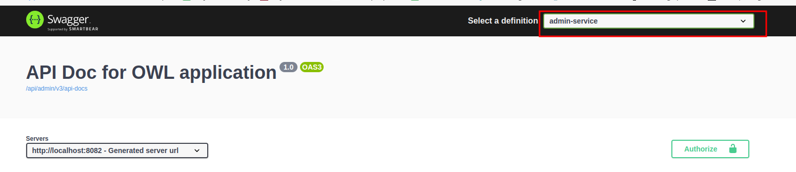

# API Docs
- Coded APIDoc:
  + Run AdminService
  + Run BookService
  + Run OntologyService
  + Run APIGateway Service
  + Access APIDoc at: http://localhost:8081/webjars/swagger-ui/index.html
  + Change the service APIDoc at:
    
  + Note that we must access all API through API Gateway (port 8081):
    + Admin service APIs will be prefixed with admin:
      + api/books -> localhost:8081/api/admin/books
    + Book service APIs will be prefixed with books:
      + api/categories -> localhost:8081/api/books/categories
    + Ontology service APIs will be prefixed with ontology:
      + api/books -> localhost:8081/api/ontology/books
- Pre-coded APIDoc:
  + View at: <br>
    ── APIDoc <br>
        ── admin.yaml <br>
        ── user.yaml

# OWL_EBOOK_Search

## Configuring OWL
### 1. Project Configuration
- Add the OWL file to your project.
  - ```tbox``` file 
  - ```abox``` file
- Ensure that the project directory structure includes OWL files in the `resources/data` folder.
- Update the `application.properties` file with the path to the OWL files.
  - ```owl.tbox.path``` - path to the TBox file 
  - ```owl.abox.path``` - path to the ABox file
  - ```ontology.tdb2.directory``` - path to the TDB2 directory

### 2. Test OWL API
- Step 1: Import API from resources folder to Postman
- Step 2: Call the `Load ontology file to TDB` API to load data from file into TDB.
- Step 3: Execute a SPARQL query using the `Sparql Query` API.
    